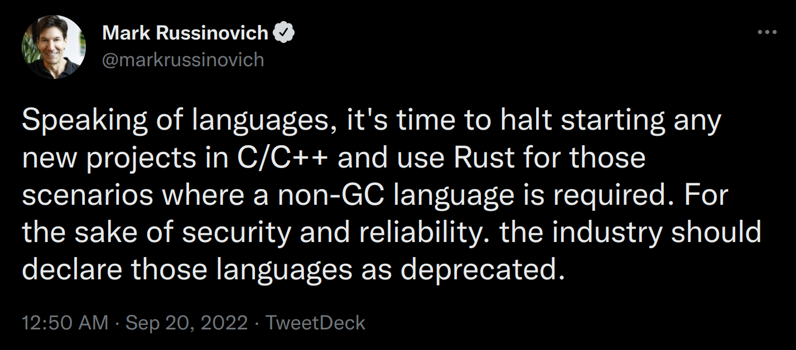
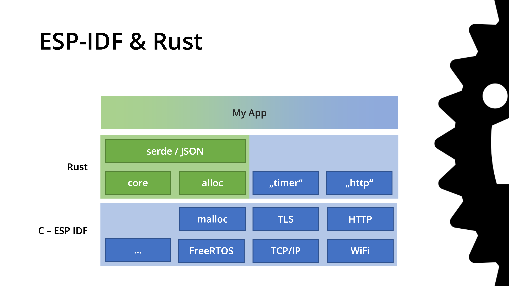
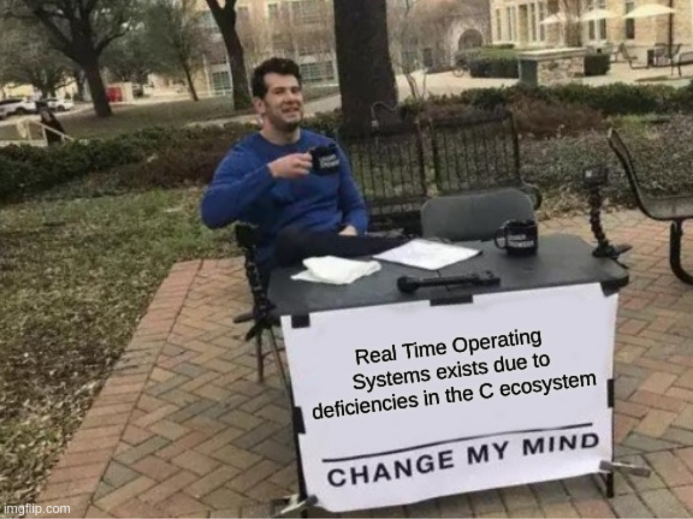
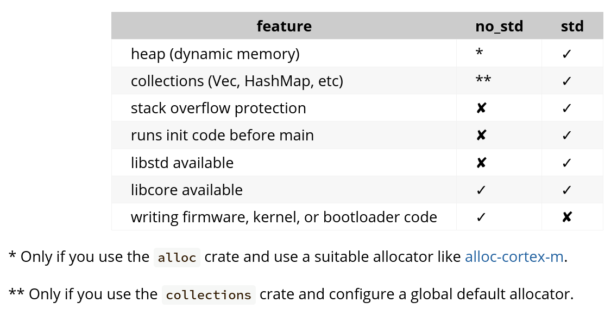

= Rust: Embedded, Async, all the way!
:authors: Ulf Lilleengen; Jens Reimann
:docinfo: private
:icons: font
:source-highlighter: highlightjs
:highlightjs-theme: https://cdnjs.cloudflare.com/ajax/libs/highlight.js/11.6.0/styles/atom-one-dark.min.css
:highlightjs-languages: rust
:revealjs_history: true

== Who are we?

* Ulf Lilleengen (@lulf)
* Jens Reimann (@ctron)

Software Engineers @ Red Hat

== What do we do?

* Work on open source IoT
* Cloud & embedded
* With a focus on "Drogue IoT"

== Why Rust?

[%notitle]
=== Why Rust?

[quote, https://rust-lang.org]
A language empowering everyone to build reliable and efficient software.

[%notitle]
=== Microsoft

[quote, Microsoft, A proactive approach to more secure code]
~70% of the vulnerabilities Microsoft assigns a CVE each year continue to be memory safety issues

=== Meaning?

Those 70% of issue would never have existed, if Rust had been used!

[%notitle]
=== Microsoft

=== Recall EclipseCon 2019?

> A tale of Rust, the ESP32 and IoT

> A talk to get you excited about Rust.

[%notitle]
=== Slide

=== We can do better!

== Embedded Rust

[.text-left]
=== Embedded?

* 16 kB - 512 kB RAM
* 128 kB - 2 MB ROM/Flash
* No operating system
* No memory allocator

[.text-left]
=== A working group

* Rust Embedded
* Working group of the Rust foundation
* Community to collaborate on Rust embedded topics

[.text-left]
=== Rust compiler

* ARM (Cortex-M)
** STM32
** nRF (micro:bit)
** Raspberry Pi Pico
* RISC-V
** ESP32 C3
* …

[.notes]
--
* First thing, we need a compiler
* Rust offers compilers for different embedded architectures out of the box
* But that doesn't give you any functionality yet
--

=== Layers

image:images/rust_layers.svg[Rust embedded layers]

[.notes]
--
* Second step: we need to build something on top of the compiler
* Mainly hardware abstraction and drivers
* So that we can build applications
* Some PACs and HALs come from the Rust embedded WG
--

[.text-left]
=== Creating applications

* Plain Rust
* RTIC
* Embassy

[.notes]
--
* First there was plain Rust
* This was used in the 2019 example, combined with FreeRTOS from the ESP-IDF
* In order to support an easier development model with interrupts, RTIC was created
* But then came `async` and changed the landscape of Rust
--

== Async Rust

[.notes]
--
What is async Rust? And how does it help in the context of "embedded"?
--

[.columns]
=== A different approach

[.column]
[source,rust]
----
async fn run () {
  select (
    loop {
      Timer::sleep_ms(250).await;
      leds.0.toggle();
    },
    loop {
      leds.1.off();
      button.wait_for_low().await;
      leds.1.on();
      button.wait_for_high().await;
    }
  ).await;
}
----

[.column]

=== Async executor

Rust requires an "executor" to drive async workload.

[.text-left]
=== Tokio

* Async executor for `std`
* Builds on top of an I/O loop

=== Bare metal vs standard library

[.notes]
--
* "std" means: standard library
* std requires a posix like operating systems, or windows
* "core" requires at lot less, but doesn't even have dynamic memory
* "alloc" brings dynamic memory, but it is optional
* not having "std" is often named "no_std"
--

=== Embassy

An executor for embedded Rust, supporting `no_std`.

[.notes]
--
* Rust "async" need an executor to drive async workload
* In "std", common executors are Tokio or "async-std"
--

[.text-left]
=== Embassy & friends

[.notes]
--
Embassy can be combined with other async Rust components.
--

* Embedded HALs
* Ector
* Drogue Device
* …

[.text-left]
=== Ector

An actor based application framework.

[.text-left]
=== Drogue Device

Bringing all components together: Bootloader, Embassy, HALs, Ector, Drivers, OTA, …

== DEMO?

[.text-left]
== Rust embedded community

Join the community!

* link:https://github.com/rust-embedded[]

Join the matrix.org chat!

* link:https://matrix.to/#/#rust-embedded:matrix.org[]
* link:https://matrix.to/#/#embassy-rs:matrix.org[]
* link:https://matrix.to/#/#drogue-iot:matrix.org[]
